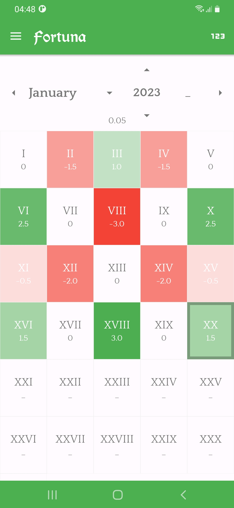
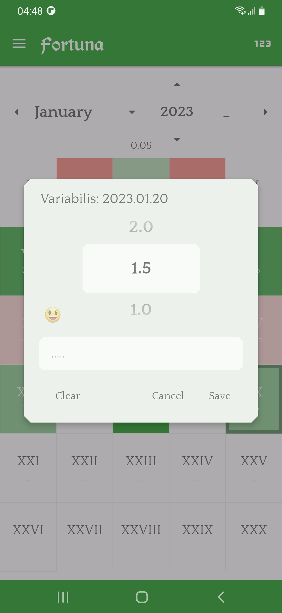
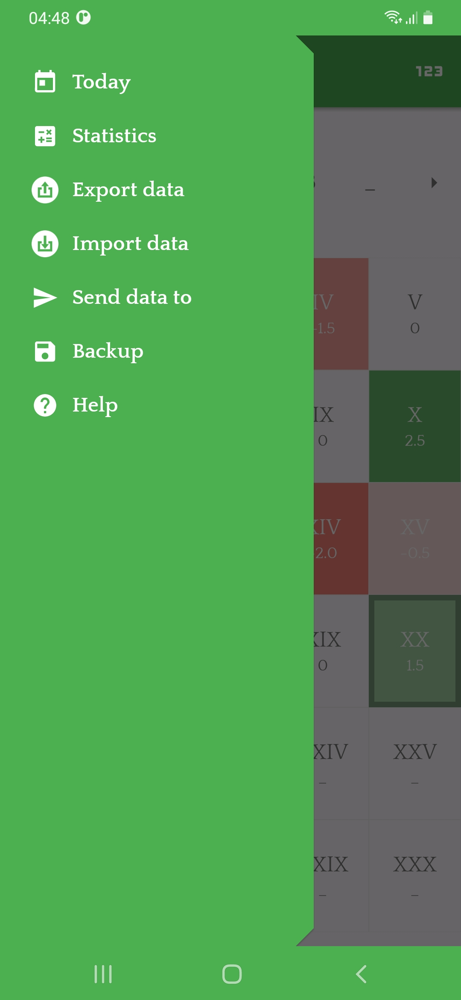

# Fortuna

A free and open-source application based on the philosophy of
[**Axiological Hedonism**](https://en.wikipedia.org/wiki/Hedonism#Axiological_hedonism).

This app simply lets you record a mean amount of pleasure and pain you feel everyday in a scale
between -3 up to +3 for each day in your desired calendar system (Gregorian or etc).

Alternatively you can estimate the score of a whole month using the field
right next to the year field at the top of the page.
Then you can see how much pleasure and pain you've sensed overall in your life or in a particular
month.

You can also use this app as a diary and record your daily life events
and also set emojis for days and months.
This app is also equipped with advanced searching and navigating tools
so you'll know exactly when what happened.

<p>
  
  
  
</p>

## VITA Markup Language

Vita means *life* in Latin. Fortuna reads and writes its data in **\*.vita** plain text file format.
It defines data separated by months and every month is separated using a line break;\
At the beginning of each month, there is a "**@**" symbol and then year and month number; for
example: **@2022.03**\
You can optionally enter a "**~**" symbol and define an estimated score for the whole month
which will apply only on days with no specific score; for example **@2022.03~3**\
After a line break, there come scores for each date.
By default, first line indicates day 1 in that month and line 2 indicates day 2; for example: **0**\
Except if you want to skip some days and jump to another day,
then you'll have to explicitly specify the number of that day; for example: **5:0**\
Note that entering each day is optional, and you can even define a month with no days.\
After each day and even the month itself you can optionally enter two more values:

1. An **emoji** for that day or month after a "**;**" symbol.
2. Some **descriptions** for that day or month after ANOTHER "**;**" symbol.

Here is a complete example:

```
@2021.09~-0.5;⛓;Spent the whole month in the military...
8:-0.5;;The idea of a developing such an app came to my mind and I named it "Hedonometer" which I later called it "Fortuna".

@2022.03~0
24:1.5;🧠;Started Fortuna Android project at 10:32:21!
2
2
2
1.5
2
2.5
2;🧠;FORTUNA IS READY!!! (it used JSON to store its data)

@2022.08
3:1;;Invented VITA file format and then migrated Fortuna to it.

```

## Structure of the Source Code

#### Main Classes

- [**Fortuna.kt**](app/src/kotlin/ir/mahdiparastesh/fortuna/Fortuna.kt) : the Application subclass

- [**Main.kt**](app/src/kotlin/ir/mahdiparastesh/fortuna/Main.kt) :
  the main and only Activity instance in this app

- [**Vita.kt**](core/kotlin/ir/mahdiparastesh/fortuna/Vita.kt) :
  reads and writes Vita files and all related utilities

- [**Grid.kt**](app/src/kotlin/ir/mahdiparastesh/fortuna/Grid.kt) :
  controls the calendar table and the dialogues that might pop up while interacting with it

- [**Nyx.kt**](app/src/kotlin/ir/mahdiparastesh/fortuna/Nyx.kt) :
  a BroadcastReceiver that performs a few tasks at 12 AM; including:

    1. Updating any available views according to the new date
    2. Reminding the user to score their day if they haven't yet
    3. Backing up Vita locally and in the cloud

#### Subpackages

- [**sect**](app/src/kotlin/ir/mahdiparastesh/fortuna/sect) :
- internal and external sections of this app
- [**util**](app/src/kotlin/ir/mahdiparastesh/fortuna/util) : general-purpose utilities

### Add your own Calendar

If you don't wanna use the Gregorian calendar, you can use Fortuna in your regional calendar system.
Fortuna requires [a subclass of java.time.chrono.Chronology](
https://docs.oracle.com/en/java/javase/24/docs/api/java.base/java/time/chrono/package-summary.html).
In Fortuna, [build flavours](https://developer.android.com/build/build-variants)
represent calendar systems, so all you need to do is to:

1. Add a new build flavour for Gradle
2. Create "app/src/res_CALENDAR" (e.g. res_indian) and inside it:
    - *drawable/today_widget_preview.png* : a preview
      for [TodayWidget](app/src/kotlin/ir/mahdiparastesh/fortuna/sect/TodayWidget.kt)
    - *values/strings.xml* : month names as *<string-array name="luna"/>*
3. Attribute that build flavour to your Calendar class in Fortuna.kt.

#### **[build.gradle.kts](app/build.gradle.kts)**

```kotlin
android {
    //...
    productFlavors {
        //...
        create("indian") { applicationIdSuffix = ".indian" }
    }
    //...
    sourceSets.getByName("indian") {
        res.setSrcDirs(listOf("src/res", "src/res_indian"))
    }
    //...
}
```

#### *

*[Fortuna.kt](app/src/kotlin/ir/mahdiparastesh/fortuna/Fortuna.kt#:~:text=override%20val%20chronology)
**

```kotlin
override val chronology: Chronology = when (BuildConfig.FLAVOR) {
    //...
    "indian" -> IndianChronology.INSTANCE
    //...
}
```

#### res_indian/values/string.xml

```xml
<?xml version="1.0" encoding="utf-8"?>
<resources>
  <string-array name="luna">
    <item>Chaitra</item>
    <item>Vaisakha</item>
    <item>Jyeshtha</item>
    <item>Ashadha</item>
    <item>Shravana</item>
    <item>Bhadra</item>
    <item>Ashvin</item>
    <item>Kartika</item>
    <item>Agrahayana</item>
    <item>Pausha</item>
    <item>Magha</item>
    <item>Phalguna</item>
  </string-array>
</resources>
```

## License

```
Copyright © Mahdi Parastesh - All Rights Reserved.
```
